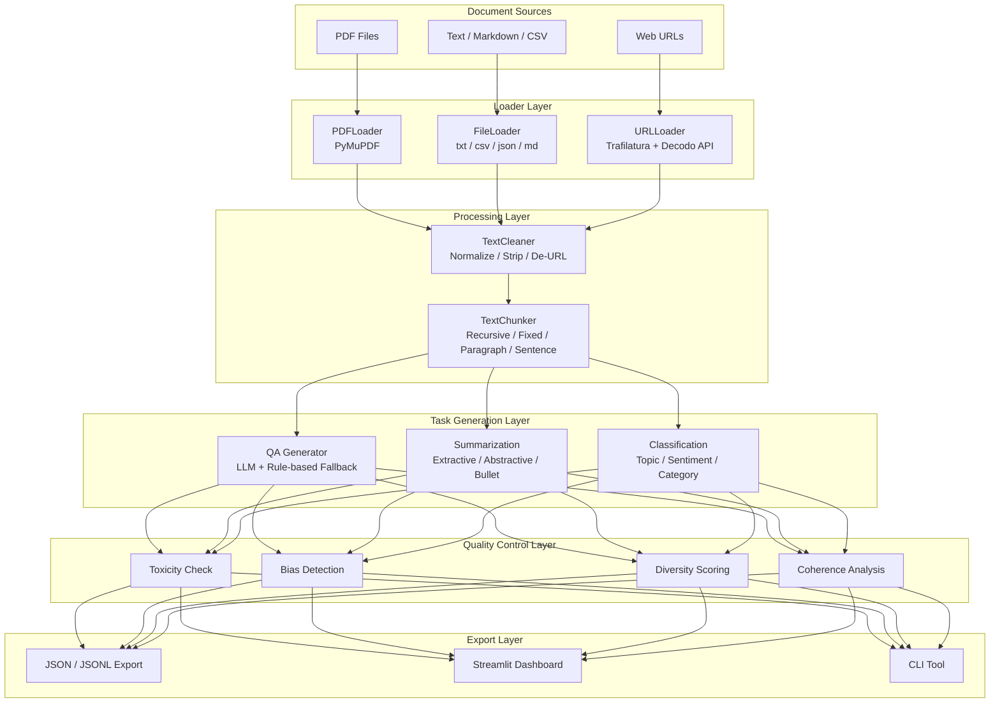
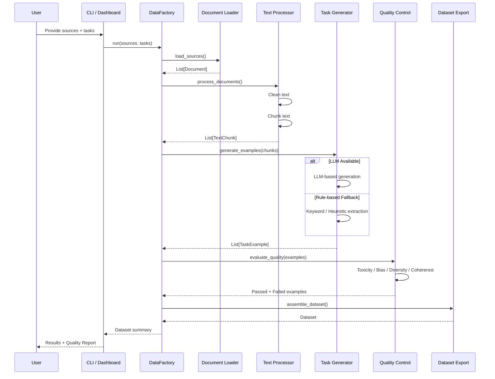
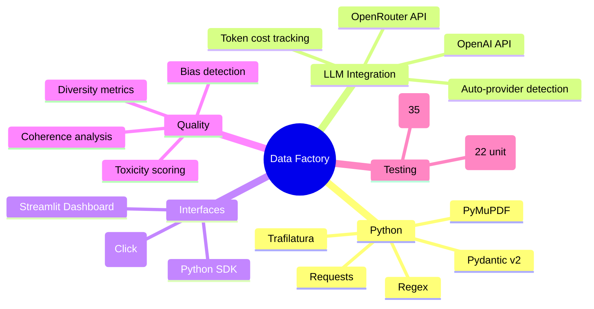
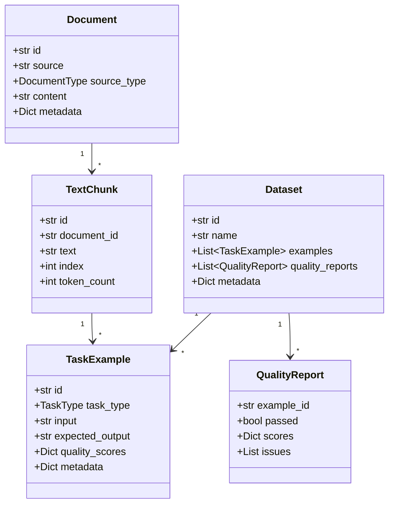
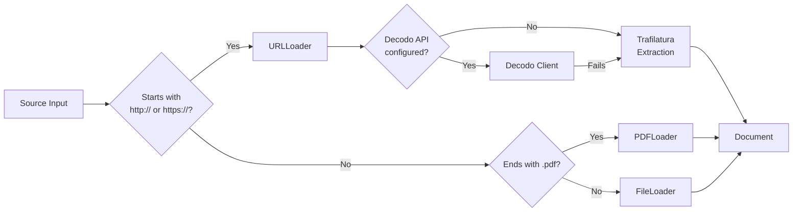
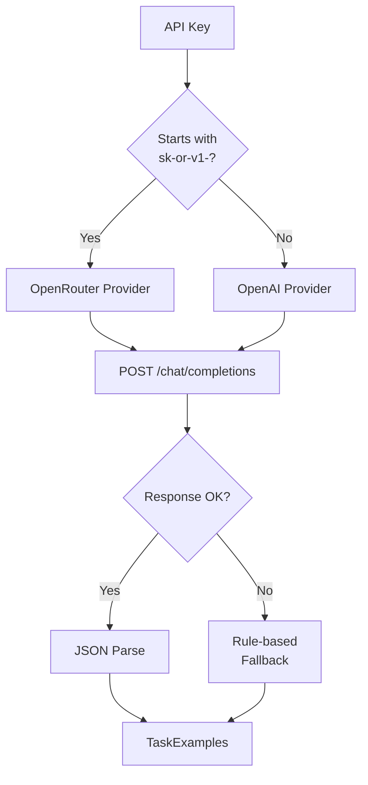

# Data Factory

**AI Training Dataset Generation Pipeline**

A modular, production-ready system for transforming raw documents into high-quality AI training datasets. Supports PDF files, plain text files, and web URLs as sources. Generates question-answer pairs, summarization tasks, and classification labels using either LLM-based generation (OpenRouter / OpenAI) or fast rule-based fallback. Includes automated quality control with configurable thresholds, a CLI tool, and an interactive Streamlit dashboard.

---
# Data Factory

**AI Training Dataset Generation Pipeline** — A modular, production-ready system for transforming raw documents into high-quality AI training datasets. Supports multiple document sources, LLM-powered and rule-based task generation, automated quality control, and interactive monitoring.


---

## Architecture



---

## Pipeline Flow



---

## Features

### Document Ingestion
| Source | Loader | Capabilities |
|--------|--------|-------------|
| PDF | PyMuPDF | Text extraction, preserves structure |
| Text files | Built-in reader | `.txt`, `.md`, `.csv`, `.json`, `.html` |
| Web URLs | Trafilatura + Decodo API | Automatic content extraction, fallback chain |

### Text Processing
- **Cleaning**: Unicode normalization, whitespace stripping, URL/HTML removal, deduplication
- **Chunking**: 4 strategies — recursive (default), fixed-size, paragraph-boundary, sentence-boundary
- **Configurable**: Overlap control, min/max chunk length, language detection

### Task Generation
| Task | LLM Mode | Rule-based Fallback |
|------|----------|-------------------|
| **QA Pairs** | GPT-4o-mini generates factual, inferential, analytical questions | Keyword extraction from sentences, interrogative detection |
| **Summarization** | GPT-4o-mini: extractive + abstractive + bullet points | Top-N sentence extraction, bullet formatting |
| **Classification** | GPT-4o-mini: topic, sentiment, category labels | Keyword-based heuristics, regex patterns |

### Quality Control
| Check | Method | Default Threshold |
|-------|--------|-----------------|
| Toxicity | Pattern-based detection | 0.1 |
| Bias | Gender / race / religious term scoring | 0.2 |
| Diversity | N-gram overlap analysis | 0.15 |
| Coherence | Sentence-logic and flow analysis | 0.3 |
| Overall | Weighted composite score | 0.3 |

### Export Formats
- **JSON** — Full dataset with metadata and quality scores
- **JSONL** — One example per line for streaming / LLM fine-tuning
- **Dashboard** — Interactive preview, filtering, and download

---

## Tech Stack



---

## Quick Start

### Installation

```bash
git clone https://github.com/pruthvirajshunde1111-ctrl/AI-training-database.git
cd AI-training-database
pip install -e .
```

### Configure API Key (Optional)

Create a `.env` file:

```env
DATAFACTORY_LLM_API_KEY=sk-or-v1-your-key-here
```

Without an API key, the pipeline runs in **rule-based fallback mode** — no external API calls, instant results.

### Run the Pipeline

**Via CLI:**

```bash
data-factory run --sources document.pdf --tasks qa summarization
data-factory run --sources https://example.com --tasks classification
data-factory list-templates
data-factory config
```

**Via Python SDK:**

```python
from data_factory import DataFactory

factory = DataFactory()
dataset = factory.run(
    sources=["notes.txt", "https://en.wikipedia.org/wiki/Python_(programming_language)"],
    tasks=["qa", "summarization"],
    max_chunks=5,
)

print(f"Generated {dataset.size} examples")
dataset.export("output/my_dataset.jsonl")
```

**Via Dashboard:**

```bash
streamlit run data_factory/dashboard/app.py
```

Open `http://localhost:8502` in your browser.

---

## Project Structure

```
data_factory/
├── __init__.py              # Public API exports
├── bot.py                   # DataFactory orchestrator
├── config.py                # FactorySettings (Pydantic)
├── models.py                # Data schemas (Document, Dataset, etc.)
│
├── loaders/
│   ├── base.py              # Abstract BaseLoader
│   ├── file_loader.py       # txt / csv / json / md
│   ├── pdf_loader.py        # PyMuPDF integration
│   └── url_loader.py        # Web scraping with fallback chain
│
├── processors/
│   ├── cleaner.py           # 8-step text cleaning pipeline
│   ├── chunker.py           # 4 chunking strategies
│   └── pipeline.py          # Clean → Chunk orchestration
│
├── tasks/
│   ├── templates.py         # Recipe cards for each task
│   ├── manager.py           # Dynamic generator loading
│   ├── qa.py                # QA pair generation
│   ├── summarization.py     # Summarization generation
│   └── classification.py    # Classification generation
│
├── quality/
│   ├── pipeline.py          # Quality orchestration
│   ├── toxicity.py          # Toxicity scoring
│   ├── bias.py              # Bias detection
│   ├── diversity.py         # Diversity analysis
│   └── coherence.py         # Coherence evaluation
│
├── integrations/
│   ├── decodo_api.py        # Decodo scraping API client
│   └── web_scraper.py       # 4-backend fallback chain
│
├── utils/
│   ├── llm_client.py        # Centralized LLM client (OpenAI / OpenRouter)
│   ├── cost_tracker.py      # Token & cost accounting
│   ├── metadata.py          # Run metadata tracking
│   └── logger.py            # Structured logging
│
├── cli/
│   └── main.py              # Click CLI (run, list-templates, config, version)
│
├── dashboard/
│   └── app.py               # Streamlit interactive dashboard
│
└── tests/
    ├── test_models.py       # 7 model tests
    ├── test_processors.py   # 8 processor tests
    └── test_quality.py      # 7 quality tests
```

---

## Module Details

### Data Models (`models.py`)



### Loader Decision Flow



### LLM Client Routing



---

## Testing

```bash
# Unit tests (22 tests)
python -m pytest data_factory/tests/ -v

# End-to-end pipeline tests (35 tests)
python test_full_pipeline.py
```

All 35 end-to-end tests validate:
- Document loading (files, PDFs, URLs)
- Text cleaning and chunking
- LLM-based and rule-based task generation
- Quality control evaluation
- Dataset assembly and export
- Cost tracking

---

## Dashboard

The Streamlit dashboard provides four tabs for interactive monitoring:

| Tab | Purpose |
|-----|---------|
| **Pipeline** | Configure sources, tasks, and run the pipeline with progress tracking |
| **Dataset** | Preview generated examples, filter by task type and quality status, download as JSON or JSONL |
| **Quality Report** | Visual quality metrics with per-example breakdown and flagged issues |
| **Run History** | Timeline of all pipeline runs with key stats |

Run with:

```bash
streamlit run data_factory/dashboard/app.py
```

Then open `http://localhost:8502`.

---

## Configuration

Key settings available via environment variables (prefix `DATAFACTORY_`):

| Variable | Default | Description |
|----------|---------|-------------|
| `DATAFACTORY_LLM_API_KEY` | — | OpenRouter or OpenAI API key |
| `DATAFACTORY_LLM_MODEL` | `gpt-4o-mini` | Model for LLM generation |
| `DATAFACTORY_CHUNK_SIZE` | `512` | Target chunk size in tokens |
| `DATAFACTORY_CHUNK_OVERLAP` | `64` | Overlap between consecutive chunks |
| `DATAFACTORY_LOG_LEVEL` | `INFO` | Logging verbosity |
| `DATAFACTORY_OUTPUT_DIR` | `output` | Dataset export directory |

Settings can also be passed programmatically:

```python
from data_factory.config import FactorySettings

settings = FactorySettings(
    llm_api_key="sk-...",
    chunk_size=1024,
    enable_toxicity_check=True,
)
```

---

## License

MIT

## Pipeline Architecture

The pipeline is organized into five sequential stages, each handled by a dedicated subsystem within the `data_factory` package.

**Stage 1: Document Loading**
Three loader types exist, each implementing a common `BaseLoader` interface. The `FileLoader` reads local files (.txt, .csv, .json, .md) with automatic encoding detection. The `PDFLoader` extracts text via PyMuPDF. The `URLLoader` fetches web pages using a browser User-Agent, extracts readable content via Trafilatura (with readability-lxml), and falls back to raw HTML if extraction fails. URL sources are detected by the `http://` or `https://` prefix. PDF sources by the `.pdf` extension. Everything else is treated as a file path.

The `DataFactory.orchestrator` routes each source to the correct loader. Failed sources are logged and skipped without aborting the run.

**Stage 2: Text Processing**
Documents pass through a `ProcessingPipeline` that applies two transformations.

First, the `TextCleaner` runs eight sequential cleaning steps: whitespace stripping, Unicode normalization, URL removal, HTML tag stripping, markdown link unwrapping, extra whitespace collapse, empty line removal, and leading/trailing dash cleanup. Each step is a standalone function that can be enabled or disabled via configuration.

Second, the `TextChunker` splits cleaned text into overlapping chunks using one of four strategies. The default `recursive` strategy attempts to split on paragraph boundaries, then sentence boundaries, then word boundaries, always respecting a maximum chunk size. The `fixed` strategy splits at exact token counts. The `paragraph` strategy preserves paragraph integrity. The `sentence` strategy splits only at sentence boundaries. All strategies support configurable overlap between consecutive chunks.

**Stage 3: Task Generation**
The `TaskManager` loads generator modules dynamically based on task names. Three generators are built in.

The `QAGenerator` produces question-answer pairs. In LLM mode, it sends each chunk to the model with a system prompt requesting factual, inferential, and analytical questions, then parses the JSON response. In rule-based mode, it splits text into sentences, detects interrogative sentences (extracting the question and answer), and for declarative sentences generates keyword-based questions by selecting representative words from the sentence.

The `SummarizationGenerator` produces three summary types per chunk. In LLM mode, the model generates extractive (key sentences verbatim), abstractive (paraphrased), and bullet-point summaries in a single API call, returned as JSON. In rule-based mode, extractive summaries take the first 2-3 sentences of the chunk, and bullet summaries list the first 4-5 sentences as bullet points.

The `ClassificationGenerator` assigns labels to chunks. In LLM mode, the model returns topic, sentiment, and category labels as JSON. In rule-based mode, keyword frequency analysis against predefined topic lexicons determines the most likely category. Sentiment is estimated using a small positive/negative word list.

Each generator supports per-chunk and per-task example limits, configurable through `FactorySettings`.

**Stage 4: Quality Control**
The `QualityPipeline` runs four independent checks on every generated example.

The toxicity checker scans example text against a compiled list of offensive terms, computes a ratio of flagged terms to total words, and scores from 0.0 (clean) to 1.0 (toxic). The bias checker looks for gender-specific terms, racial terms, and religious terms, and computes a weighted bias score. The diversity checker compares n-gram overlap between input and output using Jaccard similarity, scoring from 0.0 (identical) to 1.0 (completely different). The coherence checker validates that output sentences are complete, contain verbs, and maintain logical flow with transition words, scoring from 0.0 (incoherent) to 1.0 (coherent).

Each check has a configurable passing threshold. Default thresholds are calibrated for LLM-generated content: toxicity 0.1, bias 0.2, diversity 0.15, coherence 0.3, overall composite 0.3. Examples that fail any check are excluded from the final dataset.

**Stage 5: Export**
The assembled `Dataset` object contains the passed examples and all quality reports. It can be exported as JSON (full structure with metadata) or JSONL (one JSON object per line, suitable for LLM fine-tuning pipelines). An export path can be specified at pipeline invocation.

---

## LLM Integration

The `LLMClient` class provides a single entry point for all language model calls. It supports OpenAI-compatible APIs including OpenRouter.

Provider detection is automatic. API keys starting with `sk-or-v1-` are routed to `https://openrouter.ai/api/v1`. All other keys are routed to `https://api.openai.com/v1`. Custom base URLs can be specified in configuration.

Every LLM call is tracked by the integrated `CostTracker`, which records prompt tokens, completion tokens, and estimated cost per model per provider. Cost tracking can be enabled or disabled in settings.

When the LLM returns invalid JSON, the client attempts three fallback strategies: extracting JSON from markdown code fences, searching for the first JSON object or array in the response, and returning `None` as a last resort. All failures trigger a graceful fallback to rule-based generation.

When no API key is provided, or when the API key is explicitly set to an empty string, `LLMClient.from_settings()` returns `None` and all generators operate exclusively in rule-based mode. This enables the pipeline to function entirely offline with no external API dependencies.

---

## Data Models

Six Pydantic v2 models define the data contracts for the pipeline.

`Document` represents an ingested source. It stores the source path, source type (PDF, FILE, URL), the full text content, and a metadata dictionary for loader-specific information like fetch method and domain.

`TextChunk` represents a segment of a processed document. It stores a reference to its parent document, the chunk text, its sequential index within the document, and the estimated token count.

`TaskTemplate` defines a task recipe with a name, description, system prompt, and supported LLM model.

`TaskExample` is a single training example. It stores the task type (QA, SUMMARIZATION, CLASSIFICATION), the input text (question, instruction, or text to classify), the expected output, references to the source chunk and document, quality scores from QC, and metadata about the generation method (LLM or rule-based).

`QualityReport` stores the evaluation results for a single example. It contains the example ID, pass/fail status, per-metric scores (toxicity, bias, diversity, coherence, overall), and a list of human-readable issue descriptions.

`Dataset` is the final output container. It holds a list of examples, a list of quality reports, metadata about the run (version, chunk size, document count, task types), and supports export to JSON and JSONL formats.

---

## Configuration System

`FactorySettings` extends Pydantic `BaseSettings` with the environment prefix `DATAFACTORY_`. All settings can be set via constructor arguments, environment variables, or a `.env` file in the project root.

At import time, `config.py` calls `_load_env_file()` which reads every `KEY=VALUE` line from `.env` and loads it into `os.environ` if not already set. This ensures settings are available before Pydantic processes them.

Key setting groups include: general (project name, version, log level), document loading (max size, supported extensions, request timeout, user agent), text processing (chunk size, overlap, min/max length, cleaning steps), task generation (default tasks, examples per chunk/task, input length limits), LLM provider (api key, model, temperature, max tokens, base URL), quality control (per-check thresholds and enable flags), API integrations (Decodo key and base URL), paths (output, cache, data directories), and observability (cost tracking, metadata tracking, token logging).

The `_resolve_llm_provider` model validator runs after initialization. If the API key starts with `sk-or-v1-`, it sets the provider to `openrouter` and configures the OpenRouter base URL automatically.

---

## CLI Tool

The `data-factory` command-line tool exposes four commands.

`data-factory run --sources PATH [PATH ...] --tasks TASK [TASK ...]` executes the full pipeline. Sources can be file paths or URLs. Tasks default to `qa`, `summarization`, and `classification`. Optional flags include `--run-name`, `--export-path`, `--skip-quality`, `--max-chunks`, `--model`, `--chunk-size`, and `--log-level`.

`data-factory list-templates` prints all available task templates with their names, descriptions, and supported models in a formatted table.

`data-factory config` displays the current effective configuration with all settings and their sources (default, env, or explicit).

`data-factory version` prints the package version.

---

## Dashboard

The Streamlit dashboard provides a browser-based interface for the pipeline. It is organized into four tabs.

The Pipeline tab contains the run controls. Sources are entered one per line in a text area. Tasks are selected from a multiselect. Advanced options include run name, export path, quality check toggle, and a max chunks slider. A progress bar shows pipeline status during execution. After completion, a metrics row displays document count, chunk count, example count, and cost.

The Dataset tab displays generated examples in a sortable, filterable data table. Users can filter by task type and quality status (all, passed QC only, failed QC only). Download buttons export the dataset as JSON or JSONL.

The Quality Report tab shows per-metric average scores with visual progress bars colored green (passing), yellow (borderline), or red (failing). A list of flagged quality issues is displayed if any exist. A per-example quality scores table provides detailed breakdown.

The Run History tab lists all previous runs with timestamps, source summary, task types, document/chunk/example counts, and cost. A clear history button resets the list.

The sidebar provides settings for enabling LLM generation (with API key and model selection), chunk size, and individual quality check toggles. A status badge indicates whether LLM or rule-based mode is active.

---

## Project Structure

```
data_factory/
    __init__.py              Public API exports
    bot.py                   DataFactory orchestrator — coordinates pipeline stages
    config.py                FactorySettings with Pydantic and env prefix support
    models.py                Six Pydantic data models

    loaders/
        base.py              Abstract BaseLoader with common interface
        file_loader.py       Reads txt, csv, json, md files
        pdf_loader.py        PDF text extraction via PyMuPDF
        url_loader.py        Web page loading with fallback chain

    processors/
        cleaner.py           Eight-step text cleaning pipeline
        chunker.py           Four chunking strategies
        pipeline.py          Clean + chunk orchestration

    tasks/
        templates.py         Task recipe cards with system prompts
        manager.py           Dynamic generator module loading
        qa.py                QA pair generation (LLM + rule-based)
        summarization.py     Three summary types per chunk
        classification.py    Topic/sentiment/category labeling

    quality/
        pipeline.py          Quality check orchestration
        toxicity.py          Toxicity scoring
        bias.py              Bias detection
        diversity.py         Diversity analysis
        coherence.py         Coherence evaluation

    integrations/
        decodo_api.py        Decodo web scraping API client
        web_scraper.py       Multi-backend scraper

    utils/
        llm_client.py        Centralized LLM client with cost tracking
        cost_tracker.py      Token and cost accounting
        metadata.py          Run metadata tracking
        logger.py            Structured logging

    cli/
        main.py              Click CLI with four commands

    dashboard/
        app.py               Streamlit dashboard with four tabs

    tests/
        test_models.py       Seven model tests
        test_processors.py   Eight processor tests
        test_quality.py      Seven quality tests
```

---

## Testing

Twenty-two unit tests cover models, processors, and quality modules. Thirty-five end-to-end tests validate the full pipeline across all document types, generation modes (LLM and rule-based), quality control paths, and export formats. Tests use pytest and can be run with `python -m pytest data_factory/tests/ -v` for unit tests or `python test_full_pipeline.py` for e2e tests.

---

## Quick Start

Install the package in editable mode: `pip install -e .`

Create a `.env` file with your API key (optional — the pipeline works without it):

```
DATAFACTORY_LLM_API_KEY=sk-or-v1-your-key-here
```

Run the CLI: `data-factory run --sources my_document.txt --tasks qa summarization`

Or use the Python SDK:

```
from data_factory import DataFactory
factory = DataFactory()
dataset = factory.run(sources=["my_document.txt"], tasks=["qa", "summarization"], max_chunks=5)
dataset.export("output/dataset.jsonl")
```

Or launch the dashboard: `streamlit run data_factory/dashboard/app.py` and open `http://localhost:8502`.

---

## License

MIT
