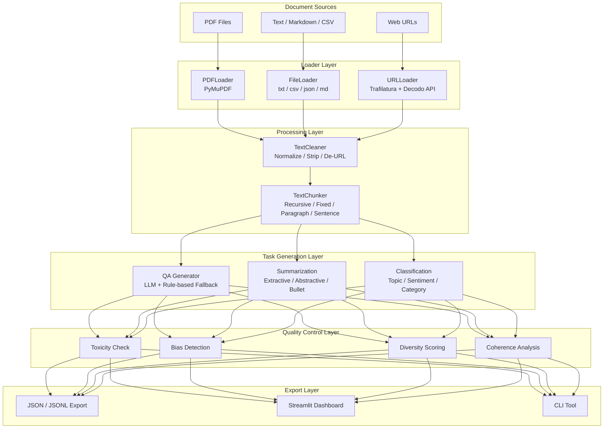
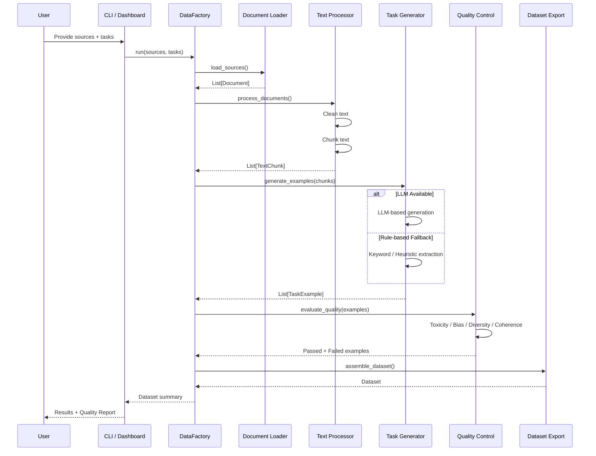
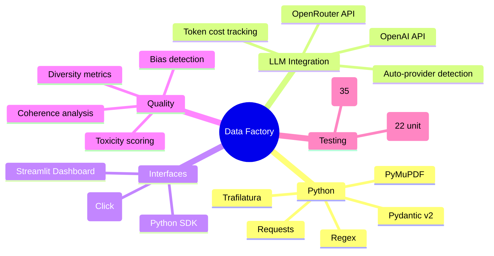
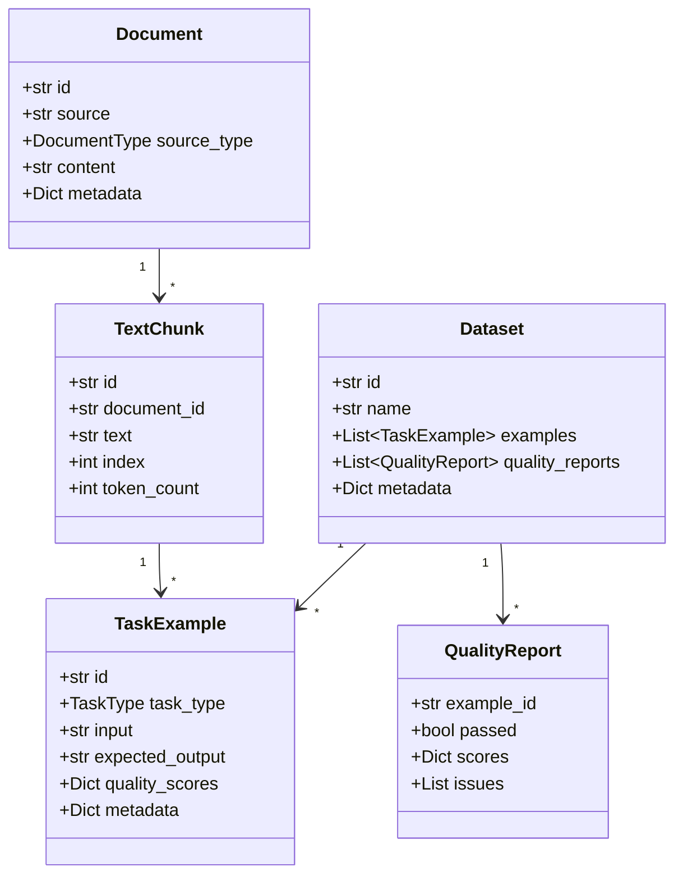
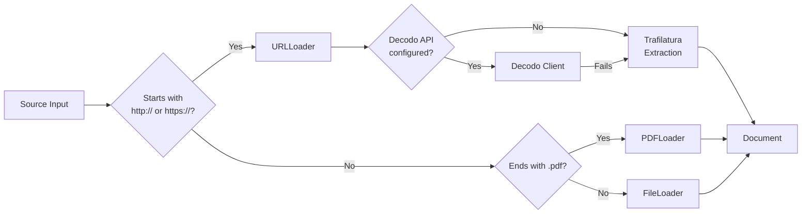
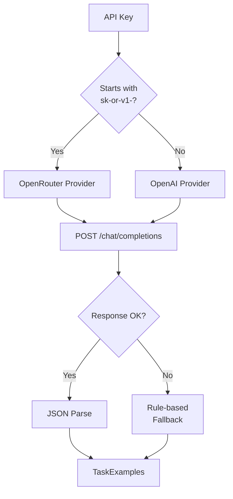

# Data Factory

**AI Training Dataset Generation Pipeline** — A modular, production-ready system for transforming raw documents into high-quality AI training datasets. Supports multiple document sources, LLM-powered and rule-based task generation, automated quality control, and interactive monitoring.


---

## Architecture



---

## Pipeline Flow



---

## Features

### Document Ingestion
| Source | Loader | Capabilities |
|--------|--------|-------------|
| PDF | PyMuPDF | Text extraction, preserves structure |
| Text files | Built-in reader | `.txt`, `.md`, `.csv`, `.json`, `.html` |
| Web URLs | Trafilatura + Decodo API | Automatic content extraction, fallback chain |

### Text Processing
- **Cleaning**: Unicode normalization, whitespace stripping, URL/HTML removal, deduplication
- **Chunking**: 4 strategies — recursive (default), fixed-size, paragraph-boundary, sentence-boundary
- **Configurable**: Overlap control, min/max chunk length, language detection

### Task Generation
| Task | LLM Mode | Rule-based Fallback |
|------|----------|-------------------|
| **QA Pairs** | GPT-4o-mini generates factual, inferential, analytical questions | Keyword extraction from sentences, interrogative detection |
| **Summarization** | GPT-4o-mini: extractive + abstractive + bullet points | Top-N sentence extraction, bullet formatting |
| **Classification** | GPT-4o-mini: topic, sentiment, category labels | Keyword-based heuristics, regex patterns |

### Quality Control
| Check | Method | Default Threshold |
|-------|--------|-----------------|
| Toxicity | Pattern-based detection | 0.1 |
| Bias | Gender / race / religious term scoring | 0.2 |
| Diversity | N-gram overlap analysis | 0.15 |
| Coherence | Sentence-logic and flow analysis | 0.3 |
| Overall | Weighted composite score | 0.3 |

### Export Formats
- **JSON** — Full dataset with metadata and quality scores
- **JSONL** — One example per line for streaming / LLM fine-tuning
- **Dashboard** — Interactive preview, filtering, and download

---

## Tech Stack



---

## Quick Start

### Installation

```bash
git clone https://github.com/pruthvirajshunde1111-ctrl/AI-training-database.git
cd AI-training-database
pip install -e .
```

### Configure API Key (Optional)

Create a `.env` file:

```env
DATAFACTORY_LLM_API_KEY=sk-or-v1-your-key-here
```

Without an API key, the pipeline runs in **rule-based fallback mode** — no external API calls, instant results.

### Run the Pipeline

**Via CLI:**

```bash
data-factory run --sources document.pdf --tasks qa summarization
data-factory run --sources https://example.com --tasks classification
data-factory list-templates
data-factory config
```

**Via Python SDK:**

```python
from data_factory import DataFactory

factory = DataFactory()
dataset = factory.run(
    sources=["notes.txt", "https://en.wikipedia.org/wiki/Python_(programming_language)"],
    tasks=["qa", "summarization"],
    max_chunks=5,
)

print(f"Generated {dataset.size} examples")
dataset.export("output/my_dataset.jsonl")
```

**Via Dashboard:**

```bash
streamlit run data_factory/dashboard/app.py
```

Open `http://localhost:8502` in your browser.

---

## Project Structure

```
data_factory/
├── __init__.py              # Public API exports
├── bot.py                   # DataFactory orchestrator
├── config.py                # FactorySettings (Pydantic)
├── models.py                # Data schemas (Document, Dataset, etc.)
│
├── loaders/
│   ├── base.py              # Abstract BaseLoader
│   ├── file_loader.py       # txt / csv / json / md
│   ├── pdf_loader.py        # PyMuPDF integration
│   └── url_loader.py        # Web scraping with fallback chain
│
├── processors/
│   ├── cleaner.py           # 8-step text cleaning pipeline
│   ├── chunker.py           # 4 chunking strategies
│   └── pipeline.py          # Clean → Chunk orchestration
│
├── tasks/
│   ├── templates.py         # Recipe cards for each task
│   ├── manager.py           # Dynamic generator loading
│   ├── qa.py                # QA pair generation
│   ├── summarization.py     # Summarization generation
│   └── classification.py    # Classification generation
│
├── quality/
│   ├── pipeline.py          # Quality orchestration
│   ├── toxicity.py          # Toxicity scoring
│   ├── bias.py              # Bias detection
│   ├── diversity.py         # Diversity analysis
│   └── coherence.py         # Coherence evaluation
│
├── integrations/
│   ├── decodo_api.py        # Decodo scraping API client
│   └── web_scraper.py       # 4-backend fallback chain
│
├── utils/
│   ├── llm_client.py        # Centralized LLM client (OpenAI / OpenRouter)
│   ├── cost_tracker.py      # Token & cost accounting
│   ├── metadata.py          # Run metadata tracking
│   └── logger.py            # Structured logging
│
├── cli/
│   └── main.py              # Click CLI (run, list-templates, config, version)
│
├── dashboard/
│   └── app.py               # Streamlit interactive dashboard
│
└── tests/
    ├── test_models.py       # 7 model tests
    ├── test_processors.py   # 8 processor tests
    └── test_quality.py      # 7 quality tests
```

---

## Module Details

### Data Models (`models.py`)



### Loader Decision Flow



### LLM Client Routing



---

## Testing

```bash
# Unit tests (22 tests)
python -m pytest data_factory/tests/ -v

# End-to-end pipeline tests (35 tests)
python test_full_pipeline.py
```

All 35 end-to-end tests validate:
- Document loading (files, PDFs, URLs)
- Text cleaning and chunking
- LLM-based and rule-based task generation
- Quality control evaluation
- Dataset assembly and export
- Cost tracking

---

## Dashboard

The Streamlit dashboard provides four tabs for interactive monitoring:

| Tab | Purpose |
|-----|---------|
| **Pipeline** | Configure sources, tasks, and run the pipeline with progress tracking |
| **Dataset** | Preview generated examples, filter by task type and quality status, download as JSON or JSONL |
| **Quality Report** | Visual quality metrics with per-example breakdown and flagged issues |
| **Run History** | Timeline of all pipeline runs with key stats |

Run with:

```bash
streamlit run data_factory/dashboard/app.py
```

Then open `http://localhost:8502`.

---

## Configuration

Key settings available via environment variables (prefix `DATAFACTORY_`):

| Variable | Default | Description |
|----------|---------|-------------|
| `DATAFACTORY_LLM_API_KEY` | — | OpenRouter or OpenAI API key |
| `DATAFACTORY_LLM_MODEL` | `gpt-4o-mini` | Model for LLM generation |
| `DATAFACTORY_CHUNK_SIZE` | `512` | Target chunk size in tokens |
| `DATAFACTORY_CHUNK_OVERLAP` | `64` | Overlap between consecutive chunks |
| `DATAFACTORY_LOG_LEVEL` | `INFO` | Logging verbosity |
| `DATAFACTORY_OUTPUT_DIR` | `output` | Dataset export directory |

Settings can also be passed programmatically:

```python
from data_factory.config import FactorySettings

settings = FactorySettings(
    llm_api_key="sk-...",
    chunk_size=1024,
    enable_toxicity_check=True,
)
```

---

## License

MIT
